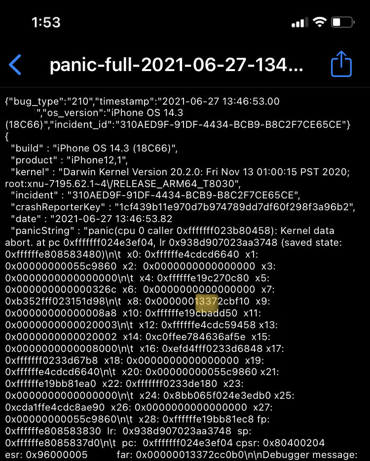

# AppleH10CamIn OOB Write/Swap vulnerability in iOS and macOS

`Patched In` 	: iOS 14.5 / macOS 11.3  
`Location`	: AppleH10CameraInterface.kext / AppleH13CameraInterface.kext  
`Author`	: [binaryboy](https://twitter.com/b1n4r1b01)

Back in January I [dropped](https://gist.github.com/b1n4r1b01/8a79465e89de8a70a3cb12680a304b17) some bugs in `AppleH10CamInUserClient`. Most of them could only be used for DoS but here I will talk about an intersting one. It is an OOB write/swap vulnerability in `AppleH10CamIn::ISP_RunAlgoChooseJasperPriPairIndices_gated()` and is reachable from selector 86 of AppleH10CamInUserClient `AppleH10CamInUserClient::_ISP_RunAlgoChooseJasperPriPairIndices()`. 

```c
AppleH10CamIn::ISP_RunAlgoChooseJasperPriPairIndices_gated(AppleH10CamIn *this, uint32_t idx, mach_vm_address_t address, uint32_t length, task_t task)
{ // here arguments idx, address and length are completely user controlled

if (!length)
{ 
	void *data_ptr = this->huge_array[idx];
	void *a1 = *(uint64_t*)(data_ptr + 0x1A0);
	...
	JasperAgileClocking::JasperSACIndexSelect(a1, NULL, ...);
	...
}
else
{
	IOMemoryDescriptor *md = IOMemoryDescriptor::withAddressRange(address, length, 2, task);
	if(!md->prepare(0))
	{
		IOMemoryMap *map = md->map(0x1000);
		if(map)
		{
			void *map_ptr = map->getVirtualAddress();
			if(map_ptr)
			{
				void *data_ptr = this->huge_array[idx];	// (A)
				void *a1 = *(uint64_t*)(data_ptr + 0x1A0); // (B)
				uint32_t pm = this->projectionMode; 
				...
				JasperAgileClocking::JasperSACIndexSelect(a1, map_ptr, ...);
			}
		}
	}
}

}

JasperAgileClocking::JasperSACIndexSelect(JasperAgileClocking *a1, void *a2, uint32_t a3, void *a4, uint32_t a5)
{ // with tuning we can make a1 point to our ToBeCorrupted struct in any kind of KHEAP_*
	if (inBufferLen)
	{
		if (a5 == kProjectionModeIDK)
		{
			*(uint64_t*)(a1 + 0x410) = *(uint64_t*)(a1 + 0x420);	// (C)
			*(uint32_t*)(a1 + 0x418) = *(uint32_t*)(a1 + 0x428);	// (D)
		}
		// in similar way for other value of a5 we can corrupt things at different offsets
	}
}
```

At `(A)` our provided `uint32_t` is used as an index for a member array of `AppleH10CamIn` which I named `huge_array`. It is an allocation of size `0x3400` containg some `0x8A8` bytes structures. There is no bounds check on our `idx` variable and thus we can read out of bounds. At `(B)` it'll read from offset `0x1A0` of that supposed `0x8A8` bytes struct. At `(C)` and `(D)` the OOB swap fianlly occours.

To trigger the bug we need to succesfully allow the creation of an `IOMemoryMap` so we have to provide a valid userland address and length. This is not a linear out of bounds bug so it isn't affected by iOS 14's heap isolation i.e. our spray data can be present in any `KHEAP` type and not specifically in `KHEAP_KEXT` where our `huge_array` allocation is present. Paired with a read primitive we can can find the address of our spray object and calculate the index variable `idx` on the fly pretty reliably. With a read primitive we can find the address of our ToBeCorrupted object and fill our spray object with its pointers. The only tricky part is to get the index right and then with the right ToBeCorrupted object cool things can be done :)

As I found a lot of bugs in this kext, I wanted to show the code quality of this driver. I tried to act cool and dropped these thinking that I might get a CVE atleast, since there was an OOB execute kind of bug in that gist as well, btw I haven't analysed it's exploitability even to this date but I do think it might be exploitable on non PAC devices. Apple patched these in iOS 14.5 (late April) but gave no credit but I guess that was the result of me disclosing unresponsibly.

Here is my attempt to overflow the pointer with a huge index and get the l33t number in a pointer, which is derefrenced and panics the kernel.



`Conclusion:` Non-linear Out Of Bounds write bugs aren't affected by techniques like Heap Isolation thus they are pretty valuable.
