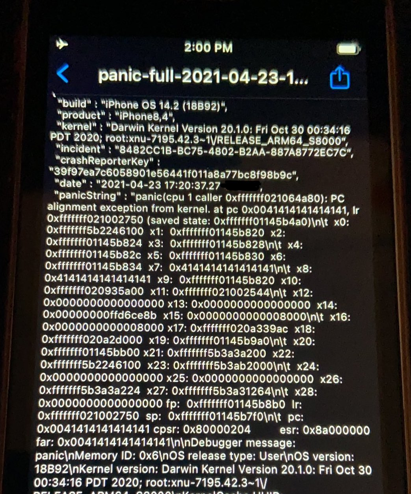

`Patched In` : iOS 14.4 / macOS 11.2  
`Location` : IOSkywalkFamily.kext  
`Discovered By` : [Proteas](https://twitter.com/ProteasWang) & [Peterpan0927](https://twitter.com/Peterpan980927)  
`CVE ID`: [CVE-2021-1757](https://support.apple.com/en-in/HT212146)  
`Author` : [binaryboy](https://twitter.com/b1n4r1b01)  


First of all I want to clear that, I did not found this bug as a 0day but I found it after looking at iOS 14.4's security updates. It was easy to diff and realise what the issue was, I also tweeted a [PoC](https://twitter.com/b1n4r1b01/status/1356512427043512320) for it. This vulnerability is present in `IOSkywalkTesterUserClient` and is a very simple yet powerful vulnerability. This UserClient exposes an `::getTargetAndMethodForIndex()` method which the userspace can invoke using `IOConnectCall*` APIs. Usually `getTargetAndMethodForIndex()` methods are supposed to take in an index (selector) from user and get a IOExternalMethod struct from an array embedded in the data section of the respective kext.

`IOSkywalkTesterUserClient::getTargetAndMethodForIndex()` on the other hand does the same thing but simply don't check for the boundness of the index provided by the user. In it's `sMethods` array we can see 4 external methods but we could send any arbitrary uint32_t index which allows us to jump to a OOB pointer.

```c
IOSkywalkTesterUserClient::getTargetAndMethodForIndex(IOSkywalkTesterUserClient *this, IOService **service, unsigned int selector)
{
	IOExternalMethod *em;

	if (service){
		em = sMethods[selector];
	}
	else{
		em = NULL;
	}
	return em;
}
```

It can be easily exploited on non-PAC devices. Exploiting this vulnerability is very simple, we need to fake a `IOExternalMethod` struct in memory. Here's what an IOExternalMethod struct looks like:

```c
struct IOExternalMethod {
	IOService *         object;
	IOMethod            func;
	IOOptionBits        flags;
	IOByteCount         count0;
	IOByteCount         count1;
};
```

Faking this struct can be done in the following way:

```c
uint64_t fake[6] = {0};
fake[1] = yourArbitraryPointer;
```

Now we have to spray this array in memory using some primitive and because we can theoractically read from anywhere on the heap our spray can lie in any `KHEAP` type. Any of the old primitives like `OSString` spray via `IOSurface` should also work fine. I personally used `pipes`. We can combine it with a read primitive, leak the address of our array in the heap and calculate the selector to be passed on to `IOConnectCallMethod` and gain PC/RIP control very deterministically.


